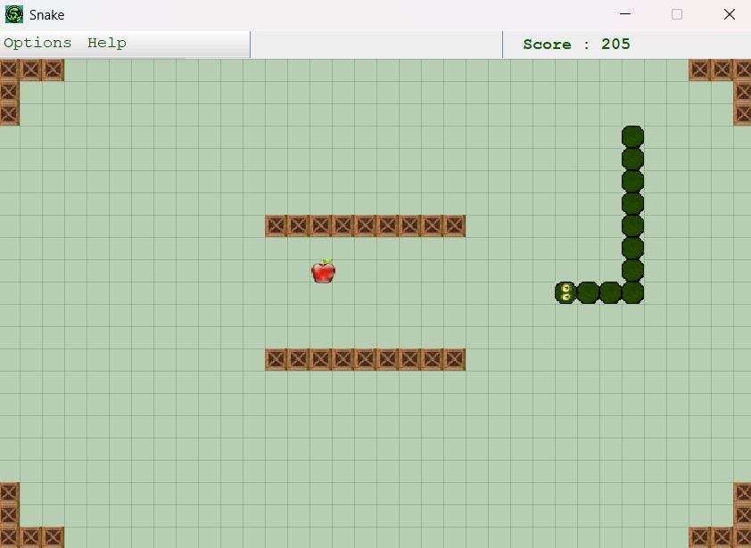

# java-snake-game
A 2D Snake Game built with Java and Swing, featuring multiple levels, custom UI, and dynamic bonus system. Developed by Khaled Kadri — Licensed under CC BY-NC.

# 🐍 Snake Game — Java Swing Edition

A **2D Snake Game** built entirely in **Java (Swing + AWT)**.  
Includes multiple levels, visual themes, and dynamic bonus animations.  
Developed with clean OOP structure and modular design by **[Khaled Kadri](https://www.linkedin.com/in/khaled-kadri/)**.

---

## 🎮 Features

✅ Classic Snake gameplay  
✅ Multiple game modes: *Classic, Box, Tunnel, Transit, Mill*  
✅ Bonus system with pulsating apples and time-limited rewards  
✅ Real-time scoring and smooth animations  
✅ Customizable grid and dark mode  
✅ Gradient progress bar and dynamic UI elements  
✅ Keyboard control support (arrow keys)  
✅ Built with pure Java (no external frameworks)

---

## Technologies Used

- **Language:** Java  
- **UI Toolkit:** Swing / AWT  
- **Graphics:** BufferedImage, Graphics2D, AffineTransform  
- **Structure:** Object-Oriented Design  
- **Version Control:** Git / GitHub  

